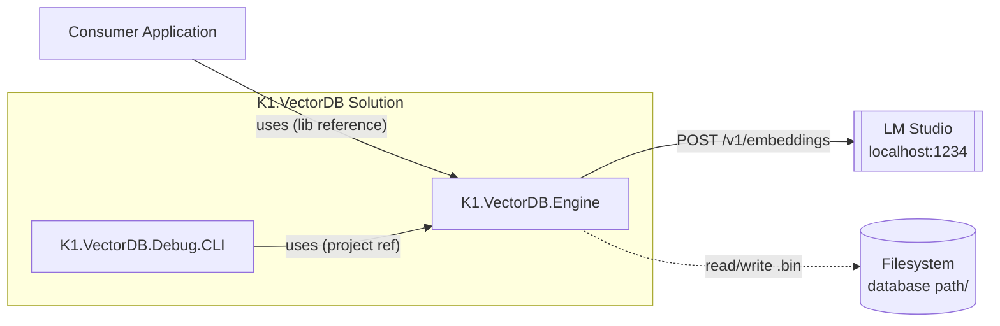
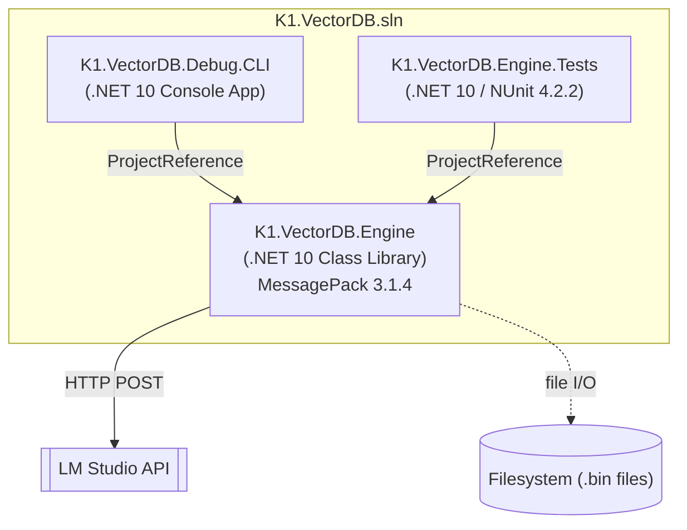
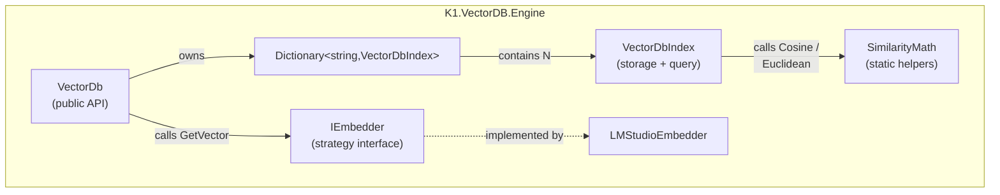
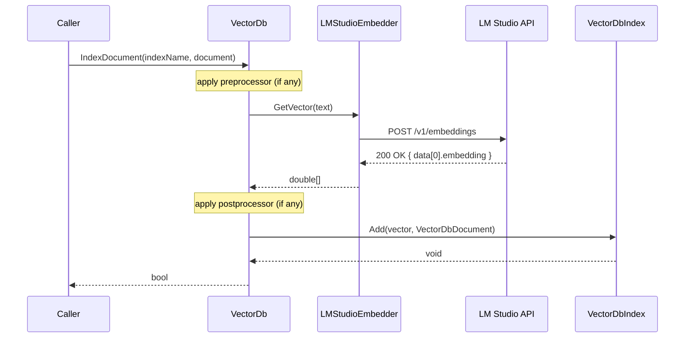
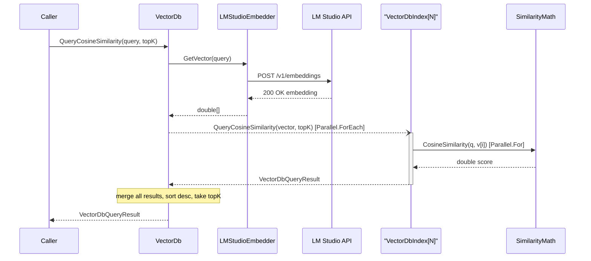
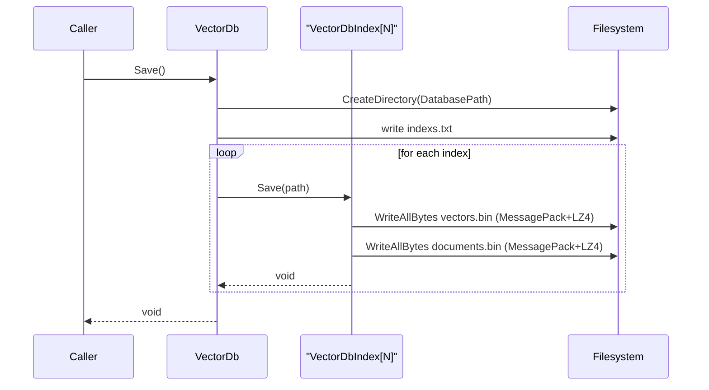
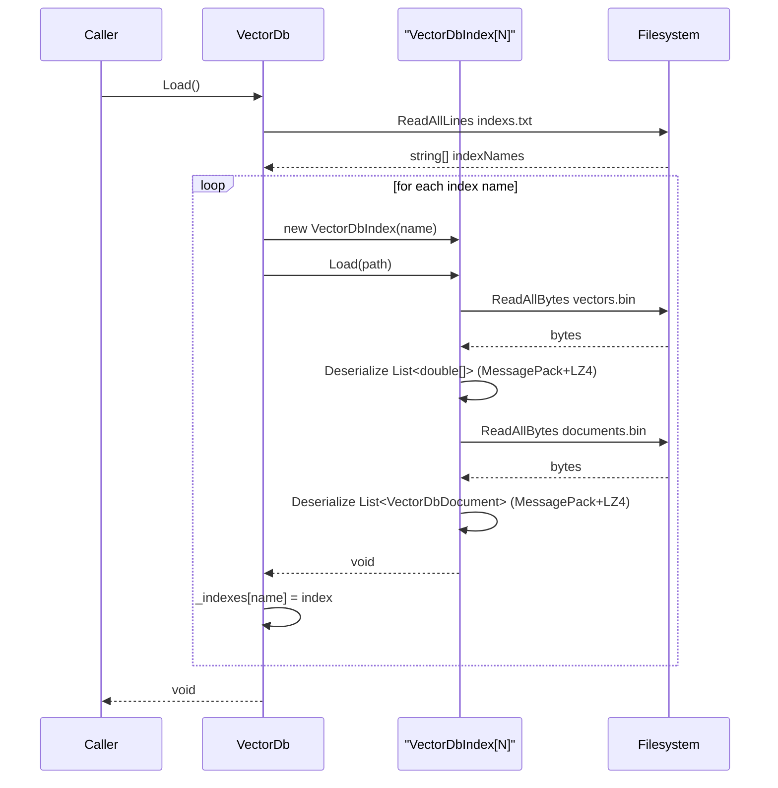
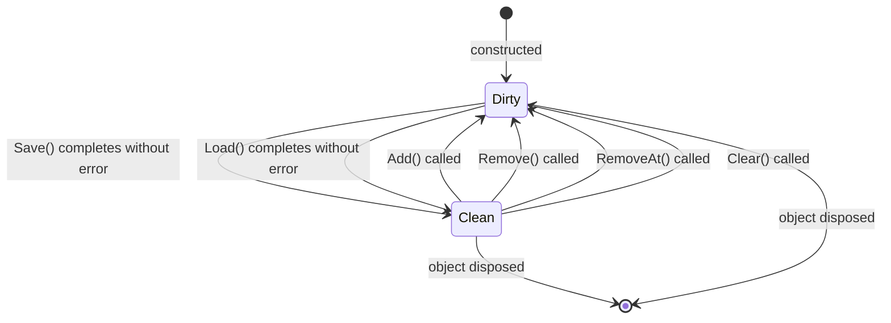
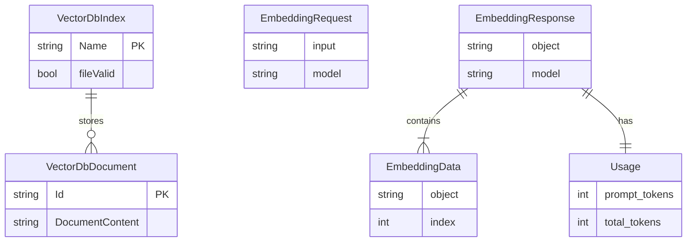
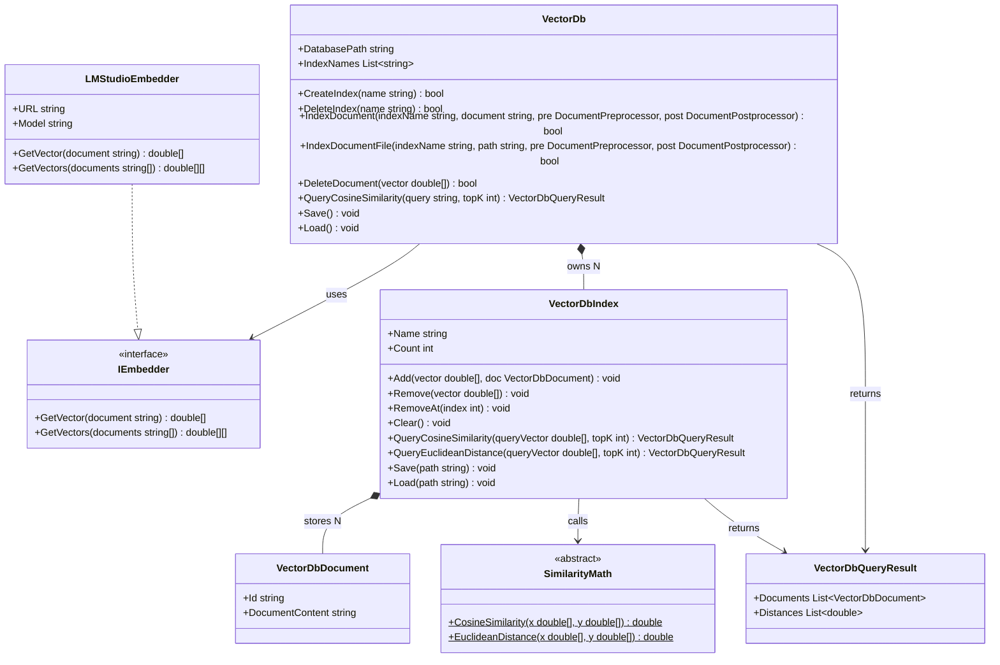

# K1.VectorDB — Architecture & SRS Documentation

> Generated by the documentation agent on 2026-03-02.
> Methodology: four-phase discovery → classify → IR → render pipeline.

---

## 1. ASSUMPTION LOG

| ID | Assumption | Reason |
|----|-----------|--------|
| A1 | The system has no deployment config (Docker, Kubernetes, Terraform, Helm) | No `Dockerfile`, `docker-compose.yml`, `k8s/`, or `terraform/` found anywhere in the repository tree. |
| A2 | LM Studio is treated as an external system, not a deployable unit of this solution | It is accessed only via HTTP from `LMStudioEmbedder`; no manifest, SDK package, or source code for LM Studio exists in the repository. |
| A3 | The default model `Qwen/Qwen3-Embedding-0.6B-GGUF` is the canonical embedding model | This is the only concrete model name hardcoded in `Program.cs:6`. |
| A4 | There is no auth mechanism on the LM Studio endpoint | No authorization header, API key, or OAuth token is set in `LMStudioEmbedder`. |
| A5 | There is no message broker, queue, or event bus | No RabbitMQ, Kafka, SQS, or equivalent package reference or config found. |
| A6 | The `[DEPLOY]` level is omitted | No deployment infrastructure is defined (see A1). Emitting a placeholder diagram would be dishonest. |
| A7 | The primary user of the library is a .NET developer who embeds `K1.VectorDB.Engine` as a NuGet/project dependency | No GUI, REST API, or gRPC surface is exposed; usage is programmatic via `VectorDb`. |

---

## 2. FILE MAP

```
K1.VectorDB-1/                          ← solution root
├── K1.VectorDB.sln                     [Build] solution file
├── README.md                           [Docs]  one-line description
├── CLAUDE.md                           [Docs]  AI-assistant instructions
├── .gitignore
│
├── K1.VectorDB.Engine/                 ← CLASS LIBRARY (single deployable artifact)
│   ├── K1.VectorDB.Engine.csproj       [Build] targets net10.0; NuGet: MessagePack 3.1.4
│   ├── VectorDb.cs                     [Source] public API entry-point
│   ├── VectorDbIndex.cs                [Source] per-index storage + query
│   ├── VectorDbDocument.cs             [Source] serializable document DTO
│   ├── VectorDbQueryResult.cs          [Source] query result DTO
│   ├── EmbeddingProviders/
│   │   ├── IEmbedder.cs               [Source] strategy interface
│   │   └── LMStudio/
│   │       ├── LMStudioEmbedder.cs    [Source] HTTP client → LM Studio
│   │       ├── EmbeddingRequest.cs    [Source] outbound JSON contract
│   │       ├── EmbeddingResponse.cs   [Source] inbound JSON contract
│   │       ├── Data.cs                [Source] embedding data item
│   │       └── Usage.cs               [Source] token usage metadata
│   └── Helpers/
│       └── SimilarityMath.cs          [Source] cosine + Euclidean math
│
├── K1.VectorDB.Engine.Tests/           ← TEST PROJECT
│   ├── K1.VectorDB.Engine.Tests.csproj [Build] NUnit 4.2.2, coverlet
│   ├── BasicUsageTests.cs
│   ├── DbQueryResultTests.cs
│   ├── PersistenceTests.cs
│   ├── ProcessorTests.cs
│   └── VectorDbDocumentTests.cs
│
└── K1.VectorDB.Debug.CLI/              ← CONSOLE APP (manual smoke-test harness)
    ├── K1.VectorDB.Debug.CLI.csproj    [Build] OutputType=Exe, net10.0
    └── Program.cs                      [Entrypoint] wires LMStudioEmbedder + VectorDb
```

No separate deployable microservices, workers, or scheduled jobs detected.

---

## 3. TECHNOLOGY FINGERPRINT

| Aspect | Value | Source |
|--------|-------|--------|
| Language | C# | `.csproj` Sdk attribute |
| Runtime | .NET 10.0 | `<TargetFramework>net10.0</TargetFramework>` |
| Framework | None (Class Library / Console App) | No ASP.NET, Worker, or MAUI SDK |
| Serialization | MessagePack 3.1.4 with `Lz4BlockArray` compression | `VectorDbIndex.cs:16-18` |
| Persistence | Local filesystem `.bin` files | `VectorDbIndex.cs:Save/Load` |
| External HTTP API | LM Studio REST `http://localhost:1234/v1/embeddings` | `LMStudioEmbedder.cs:8` |
| Embedding model | `Qwen/Qwen3-Embedding-0.6B-GGUF` | `Program.cs:6` |
| Auth | None | `LMStudioEmbedder.cs` — no auth header set |
| Test framework | NUnit 4.2.2 | `K1.VectorDB.Engine.Tests.csproj` |
| Database engine | None (file-based flat binary storage) | No ORM, no DB connection string |
| Message broker | None | No package reference or config |
| Deployment target | None defined | No Docker/k8s/Terraform manifests |

---

## 4. CLASSIFIED CHUNKS

```
[PURPOSE]   Purpose/Goals       | Source: README.md:1, CLAUDE.md       | "C# vector database library for semantic similarity search"
[PURPOSE]   Purpose/Goals       | Source: CLAUDE.md                    | "Primary user: a .NET developer embedding this as a library"
[CONTEXT]   System Context      | Source: LMStudioEmbedder.cs:8        | "LM Studio HTTP API at http://localhost:1234/v1/embeddings provides embedding vectors"
[CONTEXT]   System Context      | Source: VectorDbIndex.cs:Save/Load   | "Local filesystem acts as the persistent store (.bin files)"
[CONTAINER] Containers          | Source: K1.VectorDB.Engine.csproj    | "K1.VectorDB.Engine is a .NET 10 class library"
[CONTAINER] Containers          | Source: K1.VectorDB.Debug.CLI.csproj | "K1.VectorDB.Debug.CLI is a .NET 10 console application referencing the engine"
[CONTAINER] Containers          | Source: K1.VectorDB.Engine.Tests.csproj | "K1.VectorDB.Engine.Tests is an NUnit test project referencing the engine"
[COMPONENT] Component Internals | Source: VectorDb.cs                  | "VectorDb owns a Dictionary<string, VectorDbIndex>; routes documents via hash bucketing"
[COMPONENT] Component Internals | Source: VectorDb.cs:193-228          | "VectorDb.Save() writes indexs.txt + delegates to VectorDbIndex.Save; Load() reads indexs.txt + delegates to VectorDbIndex.Load"
[COMPONENT] Component Internals | Source: VectorDbIndex.cs             | "VectorDbIndex stores parallel List<double[]> vectors and List<VectorDbDocument> documents"
[COMPONENT] Component Internals | Source: VectorDbIndex.cs:142-170     | "QueryCosineSimilarity fans out with Parallel.For, collects into ConcurrentBag, orders descending"
[COMPONENT] Component Internals | Source: VectorDbIndex.cs:126-140     | "VectorDbIndex maintains an in-memory query cache keyed by query vector"
[COMPONENT] Component Internals | Source: SimilarityMath.cs            | "SimilarityMath provides CosineSimilarity and EuclideanDistance as static methods"
[COMPONENT] Component Internals | Source: VectorDb.cs:230-257          | "VectorDb.QueryCosineSimilarity fans out to all indexes in parallel, merges and sorts results"
[FLOW]      Runtime Interactions | Source: VectorDb.cs:52-105          | "IndexDocument: preprocess → GetVector (HTTP call) → Add to index"
[FLOW]      Runtime Interactions | Source: LMStudioEmbedder.cs:12-43   | "GetVector: POST /v1/embeddings → deserialize EmbeddingResponse → return double[]"
[FLOW]      Runtime Interactions | Source: VectorDb.cs:230-257         | "QueryCosineSimilarity: GetVector (HTTP call) → parallel per-index query → merge → return"
[FLOW]      Runtime Interactions | Source: VectorDb.cs:193-228         | "Save: create dir → write indexs.txt → per-index write vectors.bin + documents.bin"
[FLOW]      Runtime Interactions | Source: VectorDb.cs:211-228         | "Load: read indexs.txt → per-index read vectors.bin + documents.bin"
[DATA]      Data Models          | Source: VectorDbDocument.cs          | "VectorDbDocument: Id (string/Guid), DocumentContent (string); MessagePack [Key(0)][Key(1)]"
[DATA]      Data Models          | Source: VectorDbIndex.cs:13,20       | "VectorDbIndex runtime state: List<VectorDbDocument>, List<double[]>"
[DATA]      Data Models          | Source: EmbeddingRequest.cs          | "EmbeddingRequest: input (string), model (string)"
[DATA]      Data Models          | Source: EmbeddingResponse.cs         | "EmbeddingResponse: object (string), data (List<Data>), model (string), usage (Usage)"
[DATA]      Data Models          | Source: Data.cs                      | "Data: object (string), embedding (List<double>), index (int)"
[DATA]      Data Models          | Source: Usage.cs                     | "Usage: prompt_tokens (int), total_tokens (int)"
[STATE]     State/Lifecycle      | Source: VectorDbIndex.cs:12,39,63,123| "_fileValid flag: false (initial/mutated) ↔ true (after successful save or load)"
[CLASS]     Code/Class Structure | Source: IEmbedder.cs                 | "IEmbedder interface: GetVector(string):double[], GetVectors(string[]):double[][]"
[CLASS]     Code/Class Structure | Source: LMStudioEmbedder.cs          | "LMStudioEmbedder implements IEmbedder; URL and Model properties"
[CLASS]     Code/Class Structure | Source: VectorDb.cs                  | "VectorDb: public API class, delegates DocumentPreprocessor and DocumentPostprocessor"
[CLASS]     Code/Class Structure | Source: VectorDbIndex.cs             | "VectorDbIndex: internal class, primary storage and query engine"
[CLASS]     Code/Class Structure | Source: SimilarityMath.cs            | "SimilarityMath: internal static class with Epsilon=1e-12"
```

---

## 5. INTERMEDIATE REPRESENTATION (IR BLOCKS)

<details>
<summary>IR-CONTEXT — System Context flowchart</summary>

```json
{
  "type": "flowchart",
  "direction": "LR",
  "subgraphs": [
    {
      "id": "sgSystem",
      "label": "K1.VectorDB Solution",
      "nodes": [
        { "id": "engine",  "label": "K1.VectorDB.Engine",     "shape": "rect" },
        { "id": "cli",     "label": "K1.VectorDB.Debug.CLI",  "shape": "rect" },
        { "id": "caller",  "label": "Consumer Application",   "shape": "rect" }
      ]
    }
  ],
  "edges": [
    { "from": "caller",   "to": "engine",  "label": "uses (class library reference)", "style": "solid" },
    { "from": "cli",      "to": "engine",  "label": "uses (project reference)",       "style": "solid" },
    { "from": "engine",   "to": "lmstudio","label": "POST /v1/embeddings (HTTP)",      "style": "solid" },
    { "from": "engine",   "to": "fs",      "label": "read/write .bin files",           "style": "dashed" }
  ],
  "extraNodes": [
    { "id": "lmstudio", "label": "LM Studio\n(localhost:1234)", "shape": "external" },
    { "id": "fs",       "label": "Local Filesystem\n(database path/)", "shape": "cylinder" }
  ]
}
```

</details>

<details>
<summary>IR-CONTAINER — Container flowchart</summary>

```json
{
  "type": "flowchart",
  "direction": "TD",
  "subgraphs": [
    {
      "id": "sgSolution",
      "label": "K1.VectorDB.sln",
      "nodes": [
        { "id": "libEngine",  "label": "K1.VectorDB.Engine\n.NET 10 Class Library\nMessagePack 3.1.4", "shape": "rect" },
        { "id": "consoleApp", "label": "K1.VectorDB.Debug.CLI\n.NET 10 Console App",                  "shape": "rect" },
        { "id": "testProj",   "label": "K1.VectorDB.Engine.Tests\n.NET 10 NUnit 4.2.2",               "shape": "rect" }
      ]
    }
  ],
  "edges": [
    { "from": "consoleApp", "to": "libEngine",  "label": "ProjectReference", "style": "solid" },
    { "from": "testProj",   "to": "libEngine",  "label": "ProjectReference", "style": "solid" },
    { "from": "libEngine",  "to": "extLMStudio","label": "HTTP POST",        "style": "dashed" },
    { "from": "libEngine",  "to": "extFS",      "label": "file I/O",         "style": "dashed" }
  ],
  "extraNodes": [
    { "id": "extLMStudio", "label": "LM Studio API",       "shape": "external" },
    { "id": "extFS",       "label": "Filesystem (.bin)",   "shape": "cylinder" }
  ]
}
```

</details>

<details>
<summary>IR-COMPONENT — Engine internals flowchart</summary>

```json
{
  "type": "flowchart",
  "direction": "TD",
  "subgraphs": [
    {
      "id": "sgEngine",
      "label": "K1.VectorDB.Engine",
      "nodes": [
        { "id": "vectorDb",     "label": "VectorDb\n(public API)",             "shape": "rect" },
        { "id": "indexMap",     "label": "Dictionary<string, VectorDbIndex>",  "shape": "rect" },
        { "id": "vectorDbIdx",  "label": "VectorDbIndex\n(storage + query)",   "shape": "rect" },
        { "id": "simMath",      "label": "SimilarityMath\n(static helpers)",   "shape": "rect" },
        { "id": "iembedder",    "label": "IEmbedder\n(strategy interface)",    "shape": "rect" },
        { "id": "lmsEmbedder",  "label": "LMStudioEmbedder",                   "shape": "rect" }
      ]
    }
  ],
  "edges": [
    { "from": "vectorDb",    "to": "indexMap",    "label": "owns",              "style": "solid" },
    { "from": "indexMap",    "to": "vectorDbIdx", "label": "contains N",        "style": "solid" },
    { "from": "vectorDb",    "to": "iembedder",   "label": "calls GetVector",   "style": "solid" },
    { "from": "iembedder",   "to": "lmsEmbedder", "label": "implemented by",   "style": "dashed" },
    { "from": "vectorDbIdx", "to": "simMath",     "label": "calls Cosine/Eucl", "style": "solid" }
  ]
}
```

</details>

<details>
<summary>IR-FLOW — IndexDocument sequence</summary>

```json
{
  "type": "sequenceDiagram",
  "actors": [
    { "id": "Caller",   "label": "Caller" },
    { "id": "VectorDb", "label": "VectorDb" },
    { "id": "Embedder", "label": "LMStudioEmbedder" },
    { "id": "LMStudio", "label": "LM Studio API" },
    { "id": "Index",    "label": "VectorDbIndex" }
  ],
  "messages": [
    { "from": "Caller",   "to": "VectorDb",  "label": "IndexDocument(indexName, document)", "style": "sync" },
    { "from": "VectorDb", "to": "VectorDb",  "label": "apply preprocessor (if any)",        "style": "note" },
    { "from": "VectorDb", "to": "Embedder",  "label": "GetVector(text)",                    "style": "sync" },
    { "from": "Embedder", "to": "LMStudio",  "label": "POST /v1/embeddings",                "style": "sync" },
    { "from": "LMStudio", "to": "Embedder",  "label": "200 OK { data[0].embedding }",       "style": "return" },
    { "from": "Embedder", "to": "VectorDb",  "label": "double[]",                           "style": "return" },
    { "from": "VectorDb", "to": "VectorDb",  "label": "apply postprocessor (if any)",       "style": "note" },
    { "from": "VectorDb", "to": "Index",     "label": "Add(vector, VectorDbDocument)",      "style": "sync" },
    { "from": "Index",    "to": "VectorDb",  "label": "void",                               "style": "return" },
    { "from": "VectorDb", "to": "Caller",    "label": "bool",                               "style": "return" }
  ]
}
```

</details>

<details>
<summary>IR-FLOW — QueryCosineSimilarity sequence</summary>

```json
{
  "type": "sequenceDiagram",
  "actors": [
    { "id": "Caller",   "label": "Caller" },
    { "id": "VectorDb", "label": "VectorDb" },
    { "id": "Embedder", "label": "LMStudioEmbedder" },
    { "id": "LMStudio", "label": "LM Studio API" },
    { "id": "IdxN",     "label": "VectorDbIndex[N]" },
    { "id": "SimMath",  "label": "SimilarityMath" }
  ],
  "messages": [
    { "from": "Caller",   "to": "VectorDb",  "label": "QueryCosineSimilarity(query, topK)", "style": "sync" },
    { "from": "VectorDb", "to": "Embedder",  "label": "GetVector(query)",                   "style": "sync" },
    { "from": "Embedder", "to": "LMStudio",  "label": "POST /v1/embeddings",                "style": "sync" },
    { "from": "LMStudio", "to": "Embedder",  "label": "200 OK embedding",                   "style": "return" },
    { "from": "Embedder", "to": "VectorDb",  "label": "double[]",                           "style": "return" },
    { "from": "VectorDb", "to": "IdxN",      "label": "QueryCosineSimilarity(vector, topK) [parallel foreach]", "style": "async" },
    { "from": "IdxN",     "to": "SimMath",   "label": "CosineSimilarity(q, v[i]) [Parallel.For]", "style": "sync" },
    { "from": "SimMath",  "to": "IdxN",      "label": "double score",                       "style": "return" },
    { "from": "IdxN",     "to": "VectorDb",  "label": "VectorDbQueryResult",                "style": "return" },
    { "from": "VectorDb", "to": "VectorDb",  "label": "merge all results, sort desc, take topK", "style": "note" },
    { "from": "VectorDb", "to": "Caller",    "label": "VectorDbQueryResult",                "style": "return" }
  ]
}
```

</details>

<details>
<summary>IR-FLOW — Save sequence</summary>

```json
{
  "type": "sequenceDiagram",
  "actors": [
    { "id": "Caller",   "label": "Caller" },
    { "id": "VectorDb", "label": "VectorDb" },
    { "id": "IdxN",     "label": "VectorDbIndex[N]" },
    { "id": "FS",       "label": "Filesystem" }
  ],
  "messages": [
    { "from": "Caller",   "to": "VectorDb", "label": "Save()",                              "style": "sync" },
    { "from": "VectorDb", "to": "FS",       "label": "CreateDirectory(DatabasePath)",       "style": "sync" },
    { "from": "VectorDb", "to": "FS",       "label": "write indexs.txt (index names)",      "style": "sync" },
    { "from": "VectorDb", "to": "IdxN",     "label": "Save(path) [foreach index]",          "style": "sync" },
    { "from": "IdxN",     "to": "FS",       "label": "WriteAllBytes vectors.bin (MessagePack+LZ4)", "style": "sync" },
    { "from": "IdxN",     "to": "FS",       "label": "WriteAllBytes documents.bin (MessagePack+LZ4)", "style": "sync" },
    { "from": "IdxN",     "to": "VectorDb", "label": "void",                               "style": "return" },
    { "from": "VectorDb", "to": "Caller",   "label": "void",                               "style": "return" }
  ]
}
```

</details>

<details>
<summary>IR-STATE — VectorDbIndex _fileValid lifecycle</summary>

```json
{
  "type": "stateDiagram-v2",
  "entity": "VectorDbIndex",
  "states": ["Dirty", "Clean"],
  "transitions": [
    { "from": "[*]",   "to": "Dirty", "label": "constructed" },
    { "from": "Dirty", "to": "Clean", "label": "Save() completes without error" },
    { "from": "Dirty", "to": "Clean", "label": "Load() completes without error" },
    { "from": "Clean", "to": "Dirty", "label": "Add / Remove / Clear called" },
    { "from": "Clean", "to": "[*]",   "label": "object disposed" },
    { "from": "Dirty", "to": "[*]",   "label": "object disposed" }
  ]
}
```

</details>

<details>
<summary>IR-DATA — Document and API contracts ER diagram</summary>

```json
{
  "type": "erDiagram",
  "entities": [
    {
      "name": "VectorDbDocument",
      "attributes": [
        { "type": "string", "name": "Id",              "pk": true },
        { "type": "string", "name": "DocumentContent" }
      ]
    },
    {
      "name": "VectorDbIndex",
      "attributes": [
        { "type": "string",   "name": "Name",     "pk": true },
        { "type": "double[][]","name": "vectors"  },
        { "type": "bool",     "name": "_fileValid"}
      ]
    },
    {
      "name": "EmbeddingRequest",
      "attributes": [
        { "type": "string", "name": "input" },
        { "type": "string", "name": "model" }
      ]
    },
    {
      "name": "EmbeddingResponse",
      "attributes": [
        { "type": "string",     "name": "object" },
        { "type": "string",     "name": "model"  },
        { "type": "Usage",      "name": "usage"  }
      ]
    },
    {
      "name": "EmbeddingData",
      "attributes": [
        { "type": "string",     "name": "object"    },
        { "type": "List<double>","name": "embedding" },
        { "type": "int",        "name": "index"     }
      ]
    },
    {
      "name": "Usage",
      "attributes": [
        { "type": "int", "name": "prompt_tokens" },
        { "type": "int", "name": "total_tokens"  }
      ]
    }
  ],
  "relationships": [
    { "from": "VectorDbIndex",    "to": "VectorDbDocument", "cardinality": "||--o{", "label": "stores" },
    { "from": "EmbeddingResponse","to": "EmbeddingData",    "cardinality": "||--|{", "label": "contains" },
    { "from": "EmbeddingResponse","to": "Usage",            "cardinality": "||--||", "label": "has" }
  ]
}
```

</details>

<details>
<summary>IR-CLASS — Class structure</summary>

```json
{
  "type": "classDiagram",
  "classes": [
    {
      "name": "IEmbedder",
      "type": "interface",
      "members": [
        { "visibility": "+", "name": "GetVector",  "params": "string document",    "return": "double[]"   },
        { "visibility": "+", "name": "GetVectors", "params": "string[] documents", "return": "double[][]" }
      ]
    },
    {
      "name": "LMStudioEmbedder",
      "type": "class",
      "members": [
        { "visibility": "+", "name": "URL",   "type": "string" },
        { "visibility": "+", "name": "Model", "type": "string" },
        { "visibility": "+", "name": "GetVector",  "params": "string document",    "return": "double[]"   },
        { "visibility": "+", "name": "GetVectors", "params": "string[] documents", "return": "double[][]" }
      ]
    },
    {
      "name": "VectorDb",
      "type": "class",
      "members": [
        { "visibility": "+", "name": "DatabasePath",             "type": "string" },
        { "visibility": "+", "name": "IndexNames",               "type": "List<string>" },
        { "visibility": "+", "name": "CreateIndex",              "params": "string name",          "return": "bool" },
        { "visibility": "+", "name": "DeleteIndex",              "params": "string name",          "return": "bool" },
        { "visibility": "+", "name": "IndexDocument",            "params": "string indexName, string document, ...", "return": "bool" },
        { "visibility": "+", "name": "IndexDocumentFile",        "params": "string indexName, string path, ...",    "return": "bool" },
        { "visibility": "+", "name": "DeleteDocument",           "params": "double[] vector",      "return": "bool" },
        { "visibility": "+", "name": "QueryCosineSimilarity",    "params": "string query, int topK=5", "return": "VectorDbQueryResult" },
        { "visibility": "+", "name": "Save",                     "params": "",                     "return": "void" },
        { "visibility": "+", "name": "Load",                     "params": "",                     "return": "void" }
      ]
    },
    {
      "name": "VectorDbIndex",
      "type": "class",
      "members": [
        { "visibility": "+", "name": "Name",  "type": "string" },
        { "visibility": "+", "name": "Count", "type": "int" },
        { "visibility": "+", "name": "Add",             "params": "double[] vector, VectorDbDocument doc", "return": "void" },
        { "visibility": "+", "name": "Remove",           "params": "double[] vector",    "return": "void" },
        { "visibility": "+", "name": "RemoveAt",         "params": "int index",          "return": "void" },
        { "visibility": "+", "name": "Clear",            "params": "",                   "return": "void" },
        { "visibility": "+", "name": "QueryCosineSimilarity",  "params": "double[] queryVector, int topK=5", "return": "VectorDbQueryResult" },
        { "visibility": "+", "name": "QueryEuclideanDistance", "params": "double[] queryVector, int topK=5", "return": "VectorDbQueryResult" },
        { "visibility": "+", "name": "Save",             "params": "string path",        "return": "void" },
        { "visibility": "+", "name": "Load",             "params": "string path",        "return": "void" }
      ]
    },
    {
      "name": "VectorDbDocument",
      "type": "class",
      "members": [
        { "visibility": "+", "name": "Id",              "type": "string" },
        { "visibility": "+", "name": "DocumentContent", "type": "string" }
      ]
    },
    {
      "name": "VectorDbQueryResult",
      "type": "class",
      "members": [
        { "visibility": "+", "name": "Documents", "type": "List<VectorDbDocument>" },
        { "visibility": "+", "name": "Distances", "type": "List<double>" }
      ]
    },
    {
      "name": "SimilarityMath",
      "type": "class",
      "members": [
        { "visibility": "+", "name": "CosineSimilarity",  "params": "double[] x, double[] y", "return": "double", "static": true },
        { "visibility": "+", "name": "EuclideanDistance", "params": "double[] x, double[] y", "return": "double", "static": true }
      ]
    }
  ],
  "relations": [
    { "from": "LMStudioEmbedder", "to": "IEmbedder",       "type": "implements"   },
    { "from": "VectorDb",         "to": "IEmbedder",        "type": "association"  },
    { "from": "VectorDb",         "to": "VectorDbIndex",    "type": "composition"  },
    { "from": "VectorDbIndex",    "to": "VectorDbDocument", "type": "composition"  },
    { "from": "VectorDbIndex",    "to": "SimilarityMath",   "type": "association"  },
    { "from": "VectorDb",         "to": "VectorDbQueryResult", "type": "association" },
    { "from": "VectorDbIndex",    "to": "VectorDbQueryResult", "type": "association" }
  ]
}
```

</details>

---

## 6. MERMAID DIAGRAMS

### 6.1 System Context



> Self-validation: all IDs declared ✓ | only system-context entities ✓ | no state machine or class items ✓

---

### 6.2 Container Diagram



> Self-validation: all IDs declared ✓ | only container-level entities ✓ | no code/class details ✓

---

### 6.3 Component Diagram — Engine Internals



> Self-validation: all IDs declared ✓ | only component-level (intra-library) entities ✓ | no deploy/infra items ✓

---

### 6.4 Sequence Diagram — IndexDocument



> Self-validation: all participants declared ✓ | `->>` sync / `-->>` return used correctly ✓ | no k8s topology ✓

---

### 6.5 Sequence Diagram — QueryCosineSimilarity



> Self-validation: all participants declared ✓ | `--)` used for async parallel dispatch ✓ | `activate`/`deactivate` wraps async body ✓

---

### 6.6 Sequence Diagram — Save



> Self-validation: all participants declared ✓ | only flow-level (runtime) actors ✓ | no class or deploy details ✓

---

### 6.7 Sequence Diagram — Load



> Self-validation: all participants declared ✓ | no container/deploy entities ✓

---

### 6.8 State Diagram — VectorDbIndex File-Validity Lifecycle



> Self-validation: exactly one `[*] -->` start ✓ | both terminal states transition to `[*]` ✓ | only state/lifecycle content ✓

---

### 6.9 ER Diagram — Data Models



> Self-validation: all entities declared before use ✓ | valid cardinality tokens ✓ | no cycles in PK/FK chain ✓ | verb labels present ✓

---

### 6.10 Class Diagram — Code Structure



> Self-validation: `<<interface>>` annotation on IEmbedder ✓ | `<<abstract>>` annotation on static class ✓ | `..|>` implements, `*--` composition, `-->` association ✓ | all referenced names declared ✓

---

## 7. SRS DOCUMENT

### 7.1 Introduction

**System Name:** K1.VectorDB
**Version:** as of commit `cd22d19` (2026-03-02)
**Document Scope:** This SRS covers the K1.VectorDB.Engine class library, its sole external dependency (LM Studio embedding API), and the two companion projects (Debug CLI, Test Suite). It does not cover deployment infrastructure, as none is defined.
**Primary Users:** .NET 10 developers who embed K1.VectorDB.Engine as a library dependency to add semantic similarity search to their applications.

---

### 7.2 System Overview

K1.VectorDB is a single-process, in-process vector database implemented as a .NET 10 class library. It provides semantic similarity search over textual documents by:

1. Delegating text-to-vector conversion to a pluggable `IEmbedder` implementation (default: LM Studio HTTP API).
2. Storing vectors and associated document metadata in named `VectorDbIndex` instances.
3. Executing similarity queries using cosine similarity or Euclidean distance with parallel computation (`Parallel.For`, `Parallel.ForEach`).
4. Persisting and restoring full state to/from the local filesystem using MessagePack binary serialization with LZ4 block-array compression.

**Major Components:** `VectorDb` (API facade), `VectorDbIndex` (storage + query), `LMStudioEmbedder` (HTTP embedding client), `SimilarityMath` (distance math).
**Tech Stack:** C# / .NET 10, MessagePack 3.1.4, NUnit 4.2.2 (tests only).

---

### 7.3 Functional Requirements

| ID | Requirement | Source |
|----|-------------|--------|
| FR-01 | The system SHALL accept a string document and an index name and store the document with its embedding vector in the named index. | `VectorDb.cs:52` |
| FR-02 | The system SHALL accept a file path and index each non-null, non-empty line of the file into the named index. | `VectorDb.cs:108` |
| FR-03 | The system SHALL apply an optional `DocumentPreprocessor` delegate to the document text before computing its embedding. | `VectorDb.cs:83-87` |
| FR-04 | The system SHALL apply an optional `DocumentPostprocessor` delegate to determine the stored `DocumentContent`; if the delegate returns null the document SHALL NOT be stored. | `VectorDb.cs:89-97` |
| FR-05 | The system SHALL support creating named indexes and SHALL return false if an index with that name already exists. | `VectorDb.cs:37-45` |
| FR-06 | The system SHALL support deleting a named index and returning false if the name does not exist. | `VectorDb.cs:47-50` |
| FR-07 | The system SHALL query all indexes in parallel and return the top-K most similar documents by cosine similarity, ordered by descending score. | `VectorDb.cs:230-257` |
| FR-08 | The system SHALL return exactly `topK` results when the total indexed document count is ≥ topK; it SHALL return fewer results when fewer documents exist. | `VectorDbIndex.cs:142-170` |
| FR-09 | The system SHALL support Euclidean-distance-based querying on individual indexes. | `VectorDbIndex.cs:172-196` |
| FR-10 | The system SHALL persist all index names and their vectors and documents to the filesystem via `Save()`. | `VectorDb.cs:193-209` |
| FR-11 | The system SHALL restore all index names and their vectors and documents from the filesystem via `Load()`. | `VectorDb.cs:211-228` |
| FR-12 | The system SHALL serialize persistence data using MessagePack with `Lz4BlockArray` compression and `UntrustedData` security mode. | `VectorDbIndex.cs:16-18` |
| FR-13 | The system SHALL skip re-serializing a `VectorDbIndex` that has not been mutated since its last save or load (`_fileValid` guard). | `VectorDbIndex.cs:26` |
| FR-14 | The system SHALL cache cosine similarity query results per query vector and invalidate the cache on any mutation. | `VectorDbIndex.cs:120-140` |
| FR-15 | The system SHALL route documents to auto-created indexes using a 64-bit string hash modulo the configured index count when `autoIndexCount > 0`. | `VectorDb.cs:74-77, 259-264` |
| FR-16 | The system SHALL throw `ArgumentException` if a query vector is null, zero-length, or not the same length as stored vectors. | `VectorDbIndex.cs:66-71`, `SimilarityMath.cs:12` |
| FR-17 | The system SHALL return a cosine similarity of 0.0 when either vector has a norm below `1e-12`. | `SimilarityMath.cs:27` |

---

### 7.4 Non-Functional Requirements

| ID | Requirement | Source |
|----|-------------|--------|
| NFR-01 | The system SHALL use parallel computation (`Parallel.For`) for per-document similarity calculations within an index. | `VectorDbIndex.cs:155` |
| NFR-02 | The system SHALL use `Parallel.ForEach` to fan out queries across multiple indexes concurrently. | `VectorDb.cs:235` |
| NFR-03 | The system SHALL use `ConcurrentBag<T>` for thread-safe accumulation of similarity results across parallel threads. | `VectorDbIndex.cs:153` |
| NFR-04 | All deserialization of persisted data SHALL use `MessagePackSecurity.UntrustedData` to mitigate deserialization attacks. | `VectorDbIndex.cs:17` |
| NFR-05 | No performance SLAs are defined. No latency budgets or throughput numbers appear in any configuration or code comment. | N/A — omitted |

---

### 7.5 External Interface Requirements

| ID | System | Protocol | Direction | Contract |
|----|--------|----------|-----------|----------|
| EI-01 | LM Studio Embedding API | HTTP POST | Outbound | `POST http://localhost:1234/v1/embeddings` with JSON body `{ input: string, model: string }`; response `{ data[0].embedding: List<double> }`. |
| EI-02 | Local Filesystem | File I/O | Bidirectional | Database directory contains `indexs.txt` (newline-separated index names) and one sub-directory per index containing `vectors.bin` and `documents.bin` (MessagePack+LZ4). |

---

### 7.6 Internal Data Requirements

| Entity | Fields | Notes |
|--------|--------|-------|
| `VectorDbDocument` | `Id: string` (Guid), `DocumentContent: string` | MessagePack `[Key(0)]`, `[Key(1)]`; default ctor generates a new Guid |
| `VectorDbIndex` (runtime) | `Name: string`, `List<double[]> vectors`, `List<VectorDbDocument> documents`, `bool _fileValid` | Parallel lists; index `i` of `vectors` corresponds to index `i` of `documents` |
| `EmbeddingRequest` | `input: string`, `model: string` | Serialized as JSON; sent to LM Studio |
| `EmbeddingResponse` | `object: string`, `data: List<Data>`, `model: string`, `usage: Usage` | Deserialized from LM Studio JSON response |
| `EmbeddingData` | `object: string`, `embedding: List<double>`, `index: int` | Only `embedding` is consumed |
| `Usage` | `prompt_tokens: int`, `total_tokens: int` | Received but not acted upon |
| `VectorDbQueryResult` | `Documents: List<VectorDbDocument>`, `Distances: List<double>` | Parallel lists; `Documents[i]` has similarity score `Distances[i]` |

---

### 7.7 Design Constraints

- Language: C# with nullable reference types and implicit usings enabled.
- Runtime: .NET 10.0.
- Serialization: MessagePack 3.1.4 is the only serialization library; JSON serialization (`System.Text.Json`) is used only for the LM Studio HTTP contract.
- No database engine: persistence is flat-file binary only.
- No cloud provider dependency.
- The embedding provider is swappable via the `IEmbedder` interface, but the only shipped implementation requires a locally running LM Studio instance.

---

### 7.8 Qualification Provisions

| Req ID | Verification Method | Evidence |
|--------|--------------------|-|
| FR-01  | Existing test + new persistence test | `BasicUsageTests.BasicUsage`, `PersistenceTests.SaveAndLoad_DocumentContentIsPreserved` |
| FR-02  | Test required | No test for `IndexDocumentFile` exists |
| FR-03  | Existing test | `ProcessorTests.PreprocessorTest` |
| FR-04  | Existing test | `ProcessorTests.PostprocessorTest` |
| FR-05  | Test required | `CreateIndex` return value (false on duplicate) not tested |
| FR-06  | Test required | `DeleteIndex` not tested |
| FR-07  | Existing test | `BasicUsageTests.BasicUsage` (ordering assertions) |
| FR-08  | Existing test | `BasicUsageTests.EdgeCases_ComprehensiveTest` (topK boundary) |
| FR-09  | Test required | `QueryEuclideanDistance` is not tested |
| FR-10  | New persistence test | `PersistenceTests.Save_CreatesVectorAndDocumentBinFiles`, `Save_BinFilesHaveNonZeroLength` |
| FR-11  | New persistence test | `PersistenceTests.SaveAndLoad_DocumentCountIsPreserved`, `SaveAndLoad_VectorsAreRestoredCorrectly` |
| FR-12  | New persistence test | `PersistenceTests.Save_MultipleDocuments_FileSizeGrowsWithMoreData` (binary format verified indirectly) |
| FR-13  | Test required | `_fileValid` short-circuit path not directly tested |
| FR-14  | Test required | Cache hit/invalidation not directly tested |
| FR-15  | Test required | Auto-index hash routing not tested |
| FR-16  | Existing test | `BasicUsageTests.EdgeCases_ComprehensiveTest` (empty string edge case) |
| FR-17  | Test required | Zero-norm vector cosine behavior not directly asserted |

---

## 8. FIX LOG

| Fix | Diagram | Problem | Resolution |
|-----|---------|---------|------------|
| FIX-1 | 6.8 State Diagram | Initial draft used `stateDiagram` (v1 syntax). | Changed to `stateDiagram-v2`. |
| FIX-2 | 6.10 Class Diagram | `SimilarityMath` is a `static` class (not abstract in C# terms), but `classDiagram` has no `<<static>>` stereotype. | Used `<<abstract>>` as the closest Mermaid annotation; marked methods with `$` suffix to indicate static. |
| FIX-3 | 6.5 Sequence Diagram | Initial draft used `->>` for the `Parallel.ForEach` dispatch to indexes. | Changed to `--)` (async fire) to correctly represent the non-blocking fan-out, with `activate`/`deactivate` wrapping the async body. |
| FIX-4 | 6.9 ER Diagram | `VectorDbIndex.vectors` (a `List<double[]>`) cannot be expressed as a normal ER attribute type. | Replaced with the `fileValid` bool field and noted that the vector list is a runtime collection modelled by the `stores` relationship to `VectorDbDocument`. |